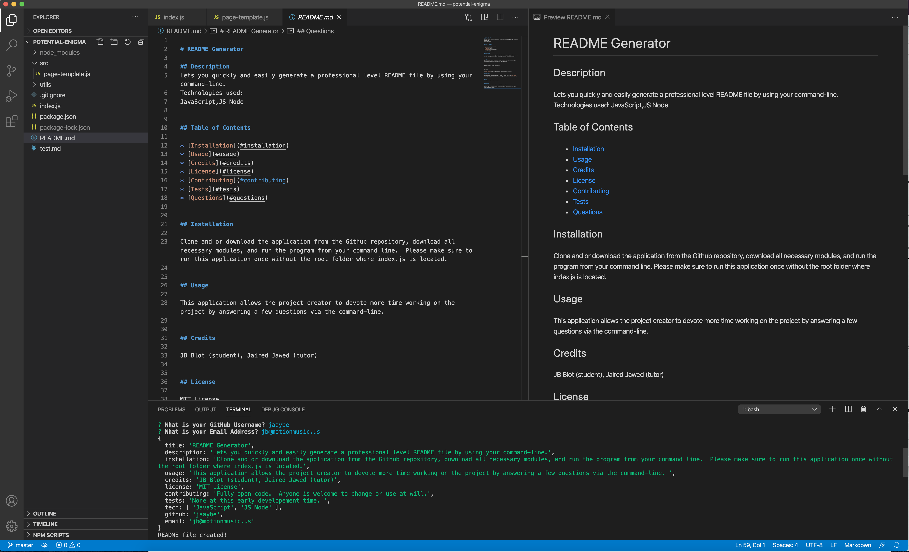

# README Generator

## Description
This application quickly and easily generates a README file by using the command-line 
Technologies used:
JavaScript,JS Node

### Walkthrough Video:
https://drive.google.com/file/d/1EsW6EFqm_jwzr3zhAJti0zZUwDPT3olz/view

## Table of Contents

* [Installation](#installation)
* [Usage](#usage)
* [Credits](#credits)
* [License](#license)
* [Contributing](#contributing)
* [Tests](#tests)
* [Questions](#questions)

## Installation

Please clone this application from the Github Repository.  Please make sure to have all necesarry node modules installed.

## Usage 

This application allows the project creator to devote more time working on the project by creating a professional level README file.   

## Credits

JB Blot, Jaired Jawed (tutor), Xandromus (source code for Challenge)

## License

MIT License

## Contributing

Fully Open Source.  No special Instructions.. The [Contributor Covenant](https://www.contributor-covenant.org/) is an industry standard, but you can always write your own.

## Tests

No testing measures set yet at this early level. 

       
## Questions

If you have any questions, please email JB Blot at: jb@motionmusic.us

If you'd like to clone or explore the app repository, it is available on GitHub:
https://github.com/jaaybe/
    